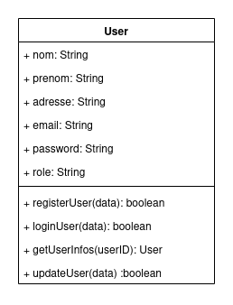
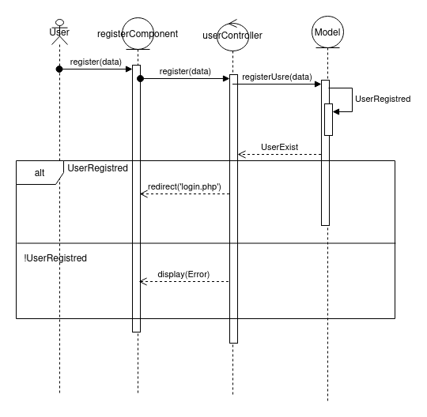
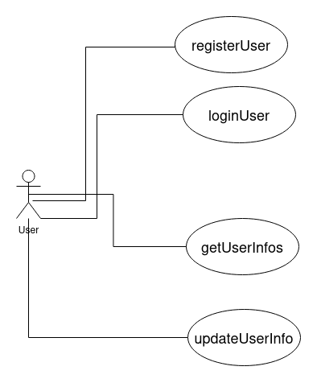
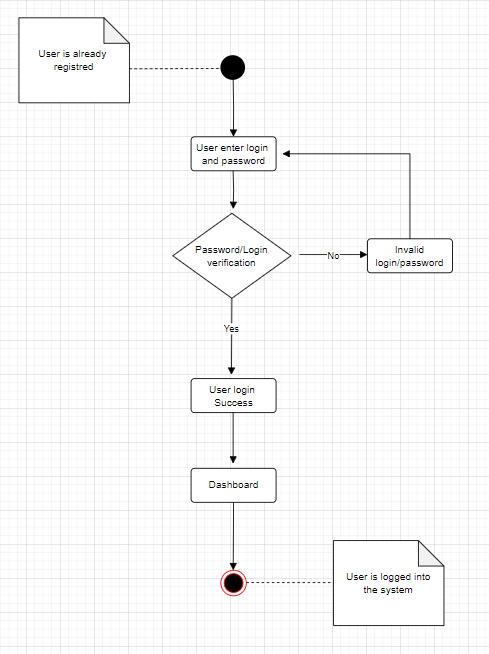
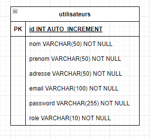

# Portfolio Website

## 1. Introduction

Le but de ce TP est de concevoir et de développer une application web de gestion d'utilisateurs avec PHP utilisant le paradigme de programmation orientée objet et le modèle-vue-contrôleur (MVC).

## 2. Conception Générale

Design moderne et responsive en accord avec la charte graphique définie. Navigation fluide entre les sections du portfolio.

## 3. Description Technique

    Utilisation des principes de POO tels que l'encapsulation, l'héritage et le polymorphisme pour concevoir les classes.
    Mise en place de méthodes et d'attributs pour encapsuler la logique et les données de l'application.
    Utilisation de l'autoloading des classes pour charger automatiquement les fichiers de classe lorsqu'ils sont nécessaires.

### Diagramme de Classes (D. Classe)

### Diagramme de Séquence (D. Séquence)

### Diagramme de Cas d'Utilisation (D. UseCase)

### Diagramme d'Activité (D. Activité)

### Diagramme de DER (D. Flux)

